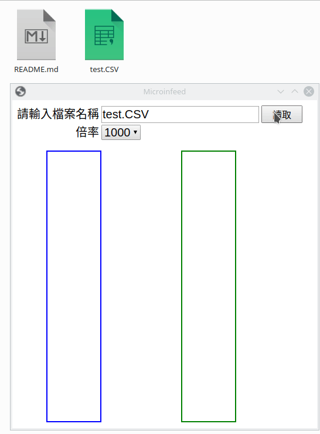
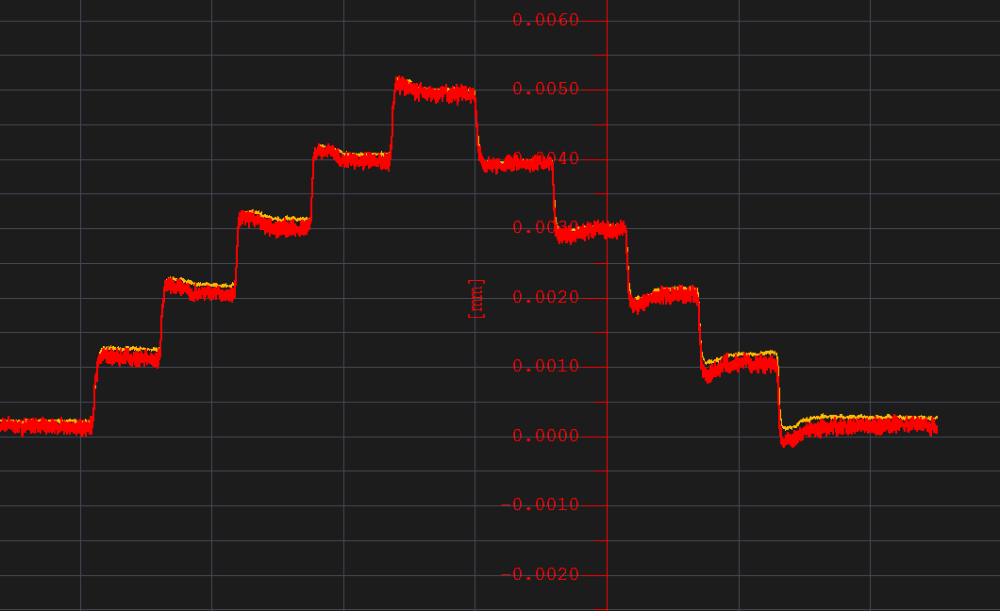
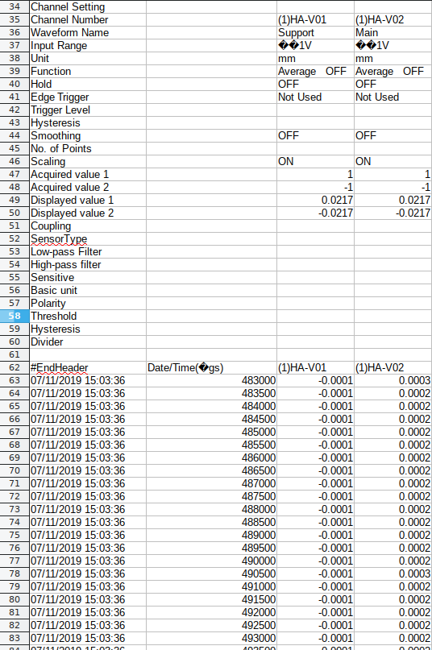

# Microinfeed

機台微進給解析器

## 微進給原始檔

- 原始微進給圖形

> 原本的微進給確認作法必須由人工去逐步確認每一個step的數值,  
確認完之後再計算每一個step與下一個step間的數值差,  
以此來確認機台在微進給時的能力

- 原始CSV檔

> 量測軟體可以將量測到的數值轉成CSV檔,因此寫了一個可以讀取CSV檔的工具,由工具去解析數據

## Version

### [1.0.1]

#### ADD

- 說明文件
